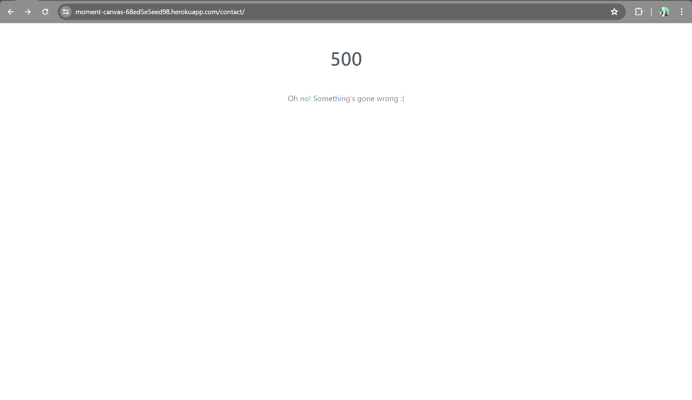

# `Pixel`
The application is available for viewing [here](https://moment-canvas-68ed5e5eed98.herokuapp.com/).

Also available for viewing here:
[Facebook Page](https://www.facebook.com/profile.php?id=61561932423026).

## Introduction
Pixel is a full-stack Django-framework collaboration platform, offering artists and drawing enthusiasts the unique opportunity to connect and collaborate globally in the name of charity. Visitors wishing to join one of Pixel's vast artistic communities need only make a small donation to a charity (or charities) of their choosing, and they immediately gain access to a unique network of artists and like-minded individuals. Additionally, users may access a community canvas on which they may collaborate on a piece with others or leave their individual mark, a chatroom, and the ability to create their own charity and register it. Pixel is a non-profit organisation, with all donations and canvas sales going to the charity. 

## Table of Contents
- [Business/Social Goals](#businesssocial-goals)
- [UX Goals](#ux-goals)
- [User Stories](#user-stories)
- [Wireframes](#wireframes)
- [Strategy](#strategy)
- [Target Audience](#target-audience)
- [Key Information Deliverables](#key-information-deliverables)
  - [Client Side](#client-side)
  - [Technical](#technical)
  - [Marketing](#marketing)
- [Features](#features)
- [Structure](#structure)
- [Models](#models)
- [Views & Templates](#views--templates)
- [Scope of Application](#scope-of-application)
- [Aesthetics](#aesthetics)
- [Technologies](#technologies)
- [Testing & Debugging](#testing--debugging)
  - [Manual Testing](#manual-testing)
  - [Automated Testing](#automated-testing)
- [Issues](#issues)
- [Accessibility & Performance](#accessibility--performance)
  - [Lighthouse](#lighthouse)
  - [Colour Accessibility Validator](#colour-accessibility-validator)
  - [HTML Validation](#html-validation)
  - [CSS Validation](#css-validation)
  - [JSHint Validation](#jshint-validation)
- [Deployment](#deployment)
  - [Foreword](#foreword)
  - [Step 1: Create an App on Heroku](#step-1-create-an-app-on-heroku)
  - [Step 2: Connect to GitHub](#step-2-connect-to-github)
  - [Step 3: Automatic Deploy (Optional)](#step-3-automatic-deploy-optional)
  - [Step 4: Settings](#step-4-settings)
  - [Step 5: Deploy Your Masterpiece](#step-5-deploy-your-masterpiece)
  - [Step 6: Where is my Application?](#step-6-where-is-my-application)
- [Forking a GitHub Repository](#forking-a-github-repository)
- [Cloning a GitHub Repository](#cloning-a-github-repository)
- [Credits](#credits)
- [Acknowledgements](#acknowledgements)

## Business/Social Goals
- As a first time visitor, I would like to view the 'moment' home page so that I have quick access to all relevant information to get started.
- As a site user, I would like access to a custom profile with my personal information and a list of charities I am a part of so that I may view and amend as needed.
- As a site user, I would like the option to read more information on the charity prior to donating.
- As a site user, it would be nice to have a contact page so that I could contact the 'Moment' team with queries.
- As a site user, I require a donations page from which I can make a secure transaction to the charity of my choosing.
- As a donatee, I require access to the Charity Canvas to collaborate with other artists.
- As a donatee, I would like access to a chat room with other people who have donated to the charity for networking and collaboration.
- As a donatee, I would like the option of viewing my past donations.
- As a donatee, I would like the option of amending my donations prior to charging my card.
- As a donatee, I would like the option of deleting items in my basket.
- As a donatee, I require a secure payment system to make donations to selected charities.
- As a (potential) donatee, I require the option of signing-up, signing-in and signing-out of my account.
- As a site visitor, I would like the option of signing up for the Moment Newsletter, without needing to register for an account.
- As a site user/donatee, I would like access to Moment's social media so that I could follow the page and stay up to date.
- As a charity organisation, I would like the option of registering my charity so that I could have my own community and raise money for my cause.

## UX Goals
- As a site user/donatee, I would like fast access to only the pages that would benefit my experience.
  -  All pages should be displayed based on whether I am registered/logged in.
  - I should be redirected to relevant pages and without coming across errors.
- As a site user/donatee, I would like all pages to follow the same branding guidelines - this includes font family, colours (colour palette), image styles, spacing, and effects. 
- As a site visitor and/or charity organisation, I would like colours to convey the correct emotions to ensure the intended branding message and motives.
- As a site user/donatee, I would like all pages to be responsive to ensure I have a good user experience. This includes best practices in legibility, colour contrast, font sizes, branding, and element visibility.

## User Stories
| Id | User Story | Label | User Story Testing |
| ----- | ----- | ----- | ----- |
| 3 | As a first time visitor, I would like to view the 'moment' home page so that I have quick access to all relevant information to get started. | `must-have` | ----- |
| 2 | As a site user, I would like access to a custom profile with my personal information and a list of charities I am a part of so that I may view and amend as needed. | `should-have` | ----- |
| 4 | As a site user, I would like the option to read more information on the charity prior to donating. | `must-have` | ----- |
| 6 | As a site user, it would be nice to have a contact page so that I could contact the 'Moment' team with queries. | `good-to-have` | ----- |
| 28 | As a site user, I require a donations page from which I can make a secure transaction to the charity of my choosing. | `must-have` | ----- |
| 5 | As a donatee, I require access to the Charity Canvas to collaborate with other artists. | `must-have` | ----- |
| 7 | As a donatee, I would like access to a chat room with other people who have donated to the charity for networking and collaboration. | `should-have` | ----- |
| 19 | As a donatee, I would like the option of viewing my past donations. | `should-have` | ----- |
| 20 | As a donatee, I would like the option of amending my donations prior to charging my card. | `must-have` | ----- |
| 21 | As a donatee, I would like the option of deleting items in my basket. | `must-have` | ----- |
| 22/23 | As a donatee, I require a secure payment system to make donations to selected charities. | `must-have` | ----- |
| 8/9 | As a (potential) donatee, I require the option of signing-up, signing-in and signing-out of my account. | `must-have` | ----- |
| 10 | As a site visitor, I would like the option of signing up for the Moment Newsletter, without needing to register for an account. | `must-have` | ----- |
| 24 | As a site user/donatee, I would like access to Moment's social media so that I could follow the page and stay up to date. | `good-to-have` | ----- |
| 31 | As a charity organisation, I would like the option of registering my charity so that I could have my own community and raise money for my cause. | `should-have` |  |

## Wireframes

## Strategy
## Target Audience
- Charity Organisations
- Artists
- Drawing Enthusiasts 
  - 16+ years of age (payment)

## Key Information Deliverables
For the purposes of navigation, the key information deliverables for this project have been split into three sections, each focusing on a different vital aspect of the project.

#### Client-Side
- _Home page_ with all relevant information about the platform.
- _Donation page_ with _Stripe_ Payments.
- Community Page
  - _Canvas_ (Canvas API + Django Channels)
  - _Chatroom_
- Creation of _Personal/Charity Profiles_ for audience expansion.

#### Technical
- _Contact page_ queries reaching Pixel _Email_.
- _Stripe_ Payments
- Testing files for all app views, urls, and models.

#### Marketing
- [Facebook Page](https://www.facebook.com/profile.php?id=61561932423026)
- Clear and intuative branding
- Legibility and responsiveness of all elements on all screen sizing

## Features
## Structure
- Navigation Bar
  - Logo
  - Links
  - Account Management Button

- Home Page*

- Contact Page
  - Contact Form
    - Validation
    - To-Email Queries
    - Success Message

- Our Work*
  - Our Team*
  - Our Communities*

_If user is not signed-in:_
- Create Account (Dropdown button menu)
  - Create Charity
    - Charity Form
    - Success Message
    - Error Message
    - Admin Approval
  - Sign Up/ Sign In (allauth)
    - Sign Up/ Sign In Form
    - Mandatory Email Verification
    - Confirmation Message

_If user is signed in:_
- Manage Account (Dropdown button menu)
  - Create Charity (same functionality)
    - Charity Form
    - Success Message
    - Error Message
    - Admin Approval
  - My Communities*
  - My Payment*
  - Sign Out (allauth)
    - Sign Out Form
    - Confirmation Message

- Footer
  - Links
  - Copyright
    - Dynamic Year

## Models
Below is a simple ERD for `moment`'s models.

#### The Charity Model
Fields: name, slug, description, entry_donation, category, image.

Meta: ordered by community size (largest to smallest).

- `name` : _CharField_ - represents the name of the charity. Max length of 150 characters. Must be unique.
- `slug` : _SlugField_ - slugified `name` field. Max length of 150 characters. Must be unique.
- `description ` : _TextField_ - represents the charity aims and objectives. Max length of 300 characters.
- `entry_donation` : _DecimalField_ - represents the minimum donation amount for users to enter the charity's community. Validations: 
  - Two decimal places.
  - Must have a minimum value of €0.01.
  - Maximum number of digits is 5. 
  - Contains help text. 
- `category` : _CharField_ - represents the category to which the charity belongs. Pre-defined selection field, max length of 25 characters, with a default value of 'Other'.
- `community_size` : _IntegerField_ - represents the number of users who have donated to the charity. Default value of 0, non-editable in admin or client-side.
- `donated_to_by` : _ManyToManyField_ - represents the users who have donated to the charity. Non-editable in admin.
- `image` : _CloudinaryField_ - charity banner image stored on [Cloudinary](https://cloudinary.com/)
- `approved` : _BooleanField_ - administration approval for any charity added to the website via the charity form.

`def save(self, *args, **kwargs)`:
Ensures the slug updates following a name change in the charity model. A `try-except` block catches the `DoesNotExist` error when creating new instances via form and saves the model accordingly.

Method:
Try:
Asserts whether the stored database charity name matches the instance Charity name with the same id. If the names do not match, regenerates (slugifies) the name and saves the model.
Except: 
Model.DoesNotExist
Saves the model as a new model instance.

#### The Donation Model
Fields: donatee, charity, amount, donation_date.

Meta: ordered by donation date (earliest to latest).

`donation_number` : CharField - represents a unique donation number for each donation. Max length of 32, automatically generated as uuid, non-editable in admin.
`donation_user` : FK : User - represents the the user who donated to the charity. On account deletion, deletes donations.
`charity` : FK : Charity - represents the charity to which the donation was made. On charity deletion, deletes donations.
`donation_amount` : DecimalField - reprents the amount to be donated. Validations: 
  - Two decimal places.
  - Must have a minimum value of €0.01.
  - Maximum number of digits is 5. 
  - Contains help text. 
`donation_date` : DateField - represents the date on which the donation was made.

`def _generate_donation_number(self):`
Returns a 32 character length unique donation number.

`def save(self, *args, **kwargs):`
If a donation does nor have a donation number, assigns a new uuid to `self.donation_number`. Saves the model instance.

#### The Profile Model
The `Profile` model has a OneToOne relationship with Django's `User` model for simplicity and ease of maintenance. Each registered `Moment` user has a profile where they can access and view their information.
Fields: user, birth_date, location, charities, date_added

`user` : OneToOneField - a direct relationship with Django's User model.
`birth_date` : DateField - reprents the user's birth date. This field can be left blank.
`charities` : ManyToManyField - represents a list of charities to which the user has donated. This field can be blank, and is not editable.
`date_added` : DateField - represents the date the user created their profile.

## Views & Templates
## Scope of Application
## Aesthetics
## Technologies
1. Django Framework - fullstack technology
2. HTML5/ Django Syntax - Used for structuring and content.
3. CSS3 - Used for adding styles to the content for legibility and aesthetic appeal.
4. Javascript - For adding basic interactivity and dynamically setting URLs.
5. Python - Used for Django manipulation & interaction.
6. FontAwesome/Bootstrap icons - used for icons.
7. Chrome Developer Tools - used for debugging the website during production.
8. Lighthouse - For performance, accessibility, best practices and SEO checking.
9. GitHub - For code storage, version control and deployment.
10. Git - For commiting through the terminal and pushing to GitHub for storage.
11. Gitpod - The IDE I developed the project in.
12. VSC - For quick testing of allauth functionality due to Gitpod's limitations.
12. Balsamiq - For project wireframe design.
13. Color Contrast Accessibility Validator - for checking colour contrast ratios.
14. W3C Markup Validation Service - to validate my HTML for potential errors.
15. W3C CSS Validation Service - to validate my CSS code for potential errors.
16. JSHint - for checking and validating my JS code. 
17. Pep8 - for Python code validation and best practices formatting.

## Testing & Debugging
This section outlines procedures for manual testing. For automated testing, please see all files `test*.py`.

- ## Manual Testing
| Feature | Expected Outcome | Testing Procedure | Result | Remark |
|---|---|---|---|---|

- ## Automated Testing

## Issues

An issue involving the `Charity` model's `slug` field was noticed when updating the `name` field. The slug did not automatically update following a name change. 

###### Solution: 
This was rectified by adding Django's `save()` method, where the stored database charity name was checked against the instance Charity name with the same id. If the names did not match, the slug was regenerated (slugified) from the name and the model was saved.

An issue involving the `ContactForm` was noticed when trying to send emails via Django's `send_mail`. While the emails sent correctly to the specified address (from the first commit, although the `subject` of the email was incorrectly being retrieved as the database abbreviate, e.g. _'General Query'_, was retrieved as _'G'_), the page would consistently fail to redirect and would display a `500` status page.

###### Solution:
Gitpod experiences an _'OSError: [Errno 101] Network is unreachable'_ when handling any form data. As such, the decision was made to temporarily switch back over to VSC, where the form could be tested significantly faster without needing to push for deployment (as this was the only place the form could be tested properly). 

`send_mail()` was removed after the main send_mail was defined - a confusing oversight on my part, where I attempted to 'call' the send_mail module. Removing this helped rectify the error and now the home page and Django success messages display appropriately. 

_Note: It is likely that a success page will be added as a redirection page instead of the home page._

An issue regarding the charity account creation form arose when attempting to create a new instance of the model via form. The `save()` method in the model would attempt to retrieve an instance from the database to check the slug field, but as the instance was not yet saved to the database, the application would throw a `DoesNotExist` error type. The model instance would still save to the database and would be visible in the Django admin panel. 

Removing this method got rid of the issue, but then the slug would not automatically update if the name of the charity was changed. The slug is needed for generating unique urls.

###### Solution: 
Perhaps the most straightforward way of bypassing this error was to wrap the method in a `try-except` block. The method would try to retrieve the model instance with a specific id (initially used for re-generating slugs). If the model instance could not be found and ran into the expected error, it saves the model instance instead of creating a new slug from the new title.

## Accessibility & Performance
### Lighthouse
### Colour Accessibility Validator
### HTML Validation
### CSS Validation
### JSHint Validation

### Pep8 Validation
All python files are regularly validated during development.

## Deployment
The application is deployed on Heroku through Git Hub and is available for viewing in the link at the top of this README.md document. To deploy a Heroku project, please refer to the guide below.

### Foreword
There are some general requirements when it comes to setting up your application and its files: 
- Your dependencies must be placed in the requirements.txt file.
- You must strictly adhere to the correct folder structure expected by Django's settings.
- In Django's settings.py file, setting Debug = True in development will display a detailed errors page if the application comes across an error hindering template rendering. It will also allow the collection of static files (stylesheets, images, and javascript files automatically). Setting Debug = False will display standard error pages under the same conditions and will not update any changes to static files.

In Heroku, this is configured under `Config Vars`, as `COLLECT_STATIC`, with the value of either:
  - `0` for blocking automatic collection
  - `1` for enabling automatic collection.

_Note: Do not commit to GitHub with Debug = True. Always set Debug = False before committing to avoid exposing personal details._

You will need two-factor verification set up to enable log in.

### Step 1: Create an App on Heroku
Log onto your Heroku dashboard using your username and password, and confirm the access code in the two-factor verification app of your choosing.

Create a new Heroku app:

You will be asked to pick a name and region for your app before clicking `Create app` on the next page.

### Step 2: Connect to GitHub
Once you've created your app, go to the `Deploy` tab at the top.

Select the middle box with GitHub's logo to connect your Heroku app to a GitHub Repository.

If prompted, authorize Heroku to access your GitHub account.
At the bottom, enter the name of the repository you wish to deploy to, and click Connect.

### Step 3: Automatic Deploy (Optional)
Under `Automatic Deploys`, choose a branch from your GitHub repository that Heroku will watch for changes.

Enable automatic deploys by clicking `Enable Automatic Deploys`. With this, every push to the selected branch will automatically deploy a new version of your app.

### Step 4: Settings
When you create the app, you will need to add the `heroku/python` buildpack in the Settings tab. 

### Step 5: Deploy Your Masterpiece
If you've enabled automatic deploys, any push to the selected branch will automatically deploy your application.

If you prefer to deploy manually or want to deploy a branch without enabling automatic deploys, go to `Manual deploy`, select the branch, and click `Deploy Branch`.

### Step 6: Where is my Application?
Your application will have a similar look to the following Heroku URL configuration: (https://*.herokuapp.com) and can be found after clicking the `Open App` button on your dashboard in the top right corner.

## Forking a GitHub Repository
To make changes to your repository without changing its original state, you can make a copy of it via `fork`. This ensures the original repository remains unchanged. 

Steps:
1. Click into the GitHub repository you want to fork.
2. Click `Fork` in the top right-hand side of the top bar, and this should take you to a page titled `Create a new fork`.
3. You can now work in this copy of your repository without making changes to the original.

## Cloning a GitHub Repository
Cloning a repository essentially means downloading a copy of your repository that can be worked on locally. This method allows for version control and backup of code.

Steps:
1. Click on the GitHub repository you want to clone.
2. Click on the `Code` button.
3. Copy the link in the dropdown.
4. Open a terminal within your VSC (or whatever IDE you choose to use).
5. In the terminal type 'git clone' and paste the URL.
6. Press Enter - you now have a cloned version of your GitHub repository.

## Credits
[Stack Overflow](https://stackoverflow.com/questions/3090302/how-do-i-get-the-object-if-it-exists-or-none-if-it-does-not-exist-in-django) - this helped with manuevering around [does not exist error](#issues)

## Acknowledgements